Visit this link for the full reverse of Botguard: [cdn.csolver.net/botguard](https://cdn.csolver.net/botguard)

# ReCaptcha BotGuard

Before we get into the process of reversing BotGuard, let's start off with some information.

BotGuard is one of the most sohphisticated antibots, it is known as the most difficult antibot to reverse.
It is used on lots of Google products, but they have a different purpose for each script.
The one I present in this reposotory is ReCaptcha's BotGuard, they use it on their main payload (`/reload`) and in ReCaptcha v2, they use it on the submit endpoint as well (`/userverify`)

Now that you know a little about where it is used, let's understand what exactly it is.
BotGuard is a script, it is a script that generates a token which is used to verify the validity of requests to google's servers.
In ReCaptcha, it is not used as a fingerprint which many beleive it is, rather it is used to verify the request is from a browser as it can only be generated if executed by a browser.
While this may seem like a "weak" aproach, it is very sophisticated, there are many checks against falsey enviroments, so patching and sandboxing is no longer on the table.
If you do not wish to reverse it, but still want to generate it, you will need a browser emulator that manages to bypass their detections.

# What Makes It Difficult?

Many people have tried and failed to reverse this antibot and because of this, it has a reputation of the "hardest" antibot, but what exactly causes such trouble?
The script isn't like any other script where you would just debug a little bit, understand an algorithm, translate to a production language, and you're done.
This script uses a VM (Virtual Machine) which virtualizes the code completely, so you cannot simply look for the algorithm or debug into it like you could with many others.
You need to write a **disassembler** and **decompiler** for this custom bytecode interpreter which makes it even harder. 
Even then, if you have experience with VMs, this shouldn't be so hard, right? **WRONG!** This VM has much more to it than standard ones you see in other VMs like **Kasada** or **Tiktok**.

So what? It has more features, we can still just debug to figure it out! Well, they've got some **anti-debug** measures which make it very hard to debug without the script throwing you onto a random path with incorrect flow.
The most obvious check they have is timing, they use `performance.now()` along with `+Date.now()` to check the time. This allows the script to know if a breakpoint has been placed, if the time is too high then it is likely the user was broken previously, in the sreenshot below you can see how it changes the **seed** which is used to determine the next byte, so it diverts the program when detected debugging. 

# Anti-Debugging Methods

Now, the `K` variable is the VM context, it holds important globals the VM uses including the **seed** which in this case is `K.U`. Notice how it has some quick math operations to determine an amount to xor the seed by? This should stay at `0` and if it isn't, the value changes, this also causes the next bytes in the program to change as well, making it a very effective anti-debug method.

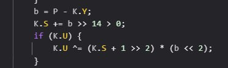

Okay, so, we haven't even started reversing and it's already looking crazy, we've just covered one of the most obvious anti-debug methods they use, but another interesting one I'd like to cover before we continue is the `anti-logger`. Unlike the anti-debugger, the anti-logger will throw it off course if it detects logging, this includes `logpoints` and calling `console.log` to inspect variables while paused. Below is another screenshot of how they override properties and bind them to change VM globals (the `K` variable)
 
- ⚠️ (I replaced `f[L]` with `f.create` due to `L` being static, I apologize if this makes it harder to follow) ⚠️

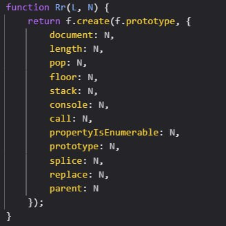

Now, this doesn't look that bad at first glance, but once we do some more digging we can find out what exactly it does. This function takes **two arguments**: `L` and `N`.
`L` is static, it's always a string `"create"` and `N` is the function given that it sets all the properties to override which sets up the `anti-logger`.
Let's move back a bit and see what the function `N` actually is since we know it is the handler for the `anti-logger`, so we should figure out what it does to throw off the program.
If we go back to the caller of `Rr` we find this block of code, now this tells us exactly what happens now.

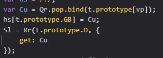

This shows us that it sends a getter method to the `Rr` function, so this means anytime any of the patched functions are called, it executes whats inside the `get` function which we know is just `Cu`.
Let's look a bit more into `Cu` function as we know it pops something whenever it is called. Let's take a look at the origin of the `Qr` variable, since without prior knowledge of how this sort of stuff works, it seems like it just pops a value off `Qr`, but thats not the case as we see here `Qr` is an empty array

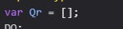

This means we are getting the method `pop` and binding it to `t.prototype[vp]` which effectively means whenever we call any of the previously patched methods on an obejct, it pops from the `t.prototype[vp]` stack.
This stack is used again in the memory reader function which is used to get bytes from memory, so if this value changes, the bytes collected off memory will change as well diverting the program again.

# Reversing The VM

Alright, so now we know how they prevent us from debugging, so we now know we cannot set breakpoints, or log values at runtime since it causes the program to break. This defintely has a lot more problems to deal with when reversing compared to a standard VM.

Let's begin by looking for the main point in the VM, we can find that in the `new window.botguard.bg()` call it initializes the VM, this is exactly what we are looking for. Have a look at this function we've just found, it seems to be modifying a large string (the VM bytecode) before sending it off to another function

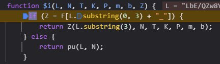

We know `L` is the bytecode, so let's see what it's doing with it. I see this: `L.substring(0, 3) + "_"` and I want to know what `F[L.substring(0, 3) + "_"]` is, it seems to be the function that initializes the VM. This is already unique, using part of the given bytecode to call the VM, nothing I've seen before, but very interesting to see. Let's see what `F.LbE_` is since `"LbE_"` is what we get from `L.substring(0, 3) + "_"`.
`F.LbE_` is the initialization function, we can see that it returns an array of two functions, these are later used to setup the `invoke` function which generates the final token 

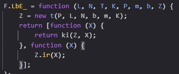

If we check out the `invoke` function, we can figure out that the first function in the returned array from the `$i` function is what generates the token taking the newly created VM context and a currently undefined variable as arguments. If we follow this a little more, we find this call which takes us to a function that seems to decode the bytecode into an array (this is the raw bytes the program follows).

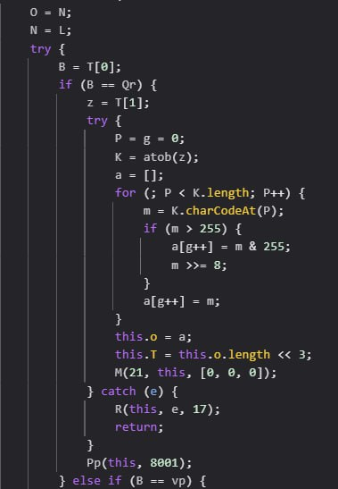

This function is very interesting, we see that after decoding the bytecode shifted to the left by 3 and stored in the context. Right after this is finished, we see another call, to a function called `Pp` which takes in the context (`this`) and a static number, `8001`, so let's look into this a bit more. This function is a larger one, again, and we can see a lot of stuff going on here.

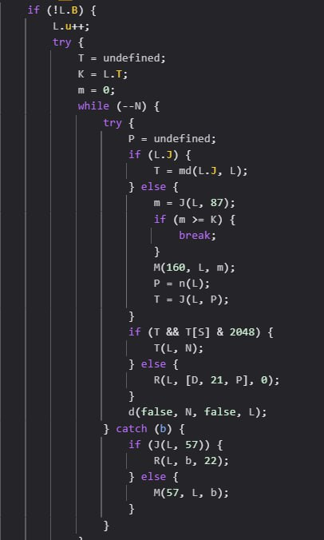

One thing that stands out to me is that it uses the `8001` and checks to make sure it is more than 0, this indicates there is a max amount of iterations the program can run. Another thing I notice is the `(m >= K)` check, this interests me because it breaks if this is met, it tells me this may be the handler for the control flow, otherwise known as the "CFH". It also seems to get both functions AND variables from a call to `J` with the first argument being the VM context and the next being a number. This should hint at being used for storing some sort of data in the VM (perhaps the registers?) and we see it used to get the `m` variable which is used in the check before breaking out of the loop. We also see it to get the `T` variable which is called if it meats some conditions, could this be the opcode? Well, let's figure that out by taking a peek at what `T` leads to, so I will add a breakpoint. I figured out that `T` is a function as you can see below, but it also calls other functions, so I inspected those as well only to find that they are reading bytes from the bytecode, this tells us that we are now dealing with an opcode for certain.

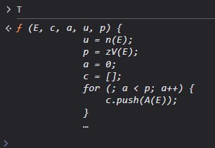

Now that we know this is the control flow handler and it executes the opcodes, we can begin writing the first part of our disassembler. Given that we know teh `J` function gets the registers, we also know that the opcodes are stored as registers which means we may need to track register values, adding more difficulty to disassembling this VM. Let's begin by figuring out which opcodes are used, and which ones are not, now you may be thinking we cannot do this because the anti-logger and anti-debugger, but you're wrong. We can log a string on each opcode, so we won't trigger anything that breaks it, we will get good data that we can use to eliminate potential "fake" opcodes. After doing this, there is multiple opcodes that are not used, let's create a table below of the ones we know are going to be used, we will add labels to them too.

| Opcode | Name      |
|--------|-----------|
| 328    | USHR      |
| 65     | SETPROP   |
| 191    | NOP       |
| 220    | IN        |
| 307    | LOADOP    |
| 45     | INITPROP  |
| 453    | OR        |
| 263    | LOADARRAY |
| 362    | LOADSTRING|
| 381    | ADD       |
| 326    | NEWARRAY  |
| 283    | TOSTRING  |
| 467    | GETPROP   |
| 289    | HALT      |
| 89     | LOADI32   |
| 348    | TYPEOF    |

We will get to it in a moment, but below are the new opcodes created at runtime.

| Opcode | Name      |
|--------|-----------|
| 127    | LOADI8    |
| 91     | LOADI16   |
| 5      | MOV       |

Now, let's begin reversing the functions that read memory or any bytes from the bytecode. I've found two methods of getting bytes as you can see in the screenshot below as they are used in an opcode.

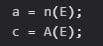

With this, we can reverse them, they are simple which is good for us, but they also each use another function called `H` and it's called like this: `H(true, L, 8)`. This function can be seen below and is clearly the main function for reading from memory, it reads a given amount of bits and based on the first argument, if it is true, it calls some cryptic functions to "encrypt" bytes before returning them. This also increases another **register variable** as it calls a function `M` which seems to be a function to set the value of a register. It seems that `87` may be the main byte position register since I also saw another opcode where it jumps to another byte address.

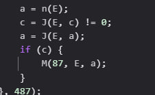

Back to what I was saying before, the read function incriments register 86 at the end of it and it works by icnrimenting the current byteposition by a dynamically changing number. So now we know what the byte position tracker is, and once again, it is stored in registers. Here we can see how it encrypts the byte before returning it, note that `K` is the return value, so we see how if `L` is truthy, it gets an array of 3 from register 21 (`J(Z, 21)`) and that seems to be the key that is used to encrypt the next byte and return it. We also can see usage of `Z.W` and `Z.U` which we already know `Z.U` is the seed used, so what is `Z.W`? Well that is the "position" as it incriments linearly unlike the rest of the values.

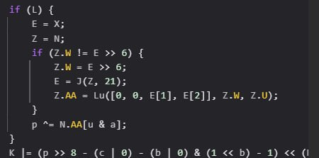

As we look more, I can even find an opcode that **changes** all 3 of those encryption "keys" including register 21, Z.W, and Z.U as you can see. This function is a "SETPROP" opcode, but it also changes the register 21 key array and the position/seed keys. It seems to reset the position key back to `undefined` and the seed gets re-read from the read function which changes the seed. The key array (reg 21), however, gets changed simply by the opcode doing it's normal operations since it is stored in a register as an array.

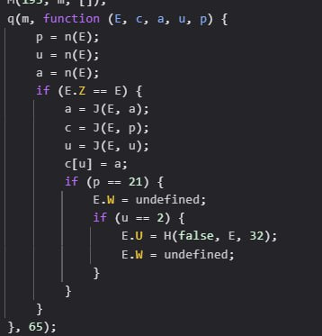

# Making The Disassembler

We have gone through a lot of this project so far, we now know how BotGuard functions, so we can get started on a disassembler.

Not quite though, one more problem we have to work out, **self-modifying opcodes**. We all knew this was coming, they HAD to have something else to hit us with, but we can take it, we see this opcode here where it looks like a simple "LOADSTRING" opcode, and it is, but it loads the stringified version of the new opcodes that it brings in at runtime. You can see this below in the screenshot I've shared how it generates a string using 2 things, first it uses the register 274 which in our disassembly so far, we know it is an array of integers. The opcode also uses another array of strings which is generated at the begining of the script.

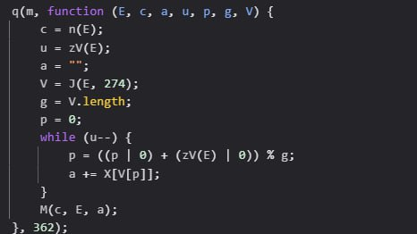

Now, we cannot load up and use new opcodes by only the string, so ofcourse they have an opcode called `EVAL` but since it is not used for anything but eval the opcodes, I called it `LOADOP`. So, let's recap really fast, we know they use registers for both variables and for opcodes, so in order to modify their opcodes and bring in new ones, they have to set a new register to the eval'd ones. Not too hard to follow, now let's impliment it into our disassembler, but, let's first use regex rather than static, so its a little bit better.

We have properly added support for everything needed, but there's still one more thing, outside of classic opcodes. It is an operation, but not quite, it is error handlers, but its responsable for one of the most important parts in the VM. It handles the main loop within the VM, but they use `loop unrolling` which is an optimization technique used, but can also be seen as obfuscation, which in this case, it could be both. Anyways, they catch errors, then send it off into another function that has a few calls to make, it modifes two different register values (arrays) and checks if another register values (integer) is more than 3, if it is, it subtracts 3 and calls another encryption function on both the arrays. This encryption function pushes the newly encrypted values into each of the arrays, it does this over and over and the loop count changes per script, but for this particular script, it takes around 38 iterations. Below you can see the error handler function.

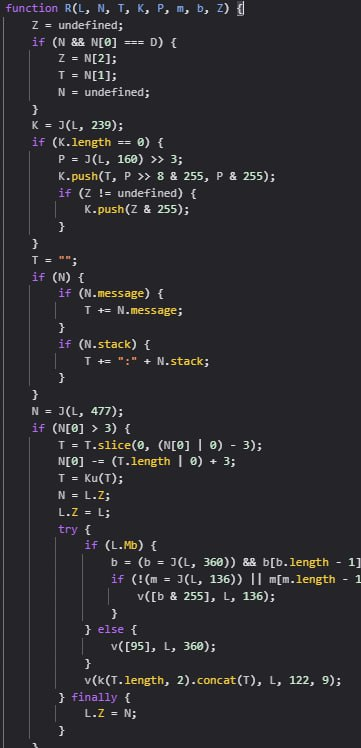
